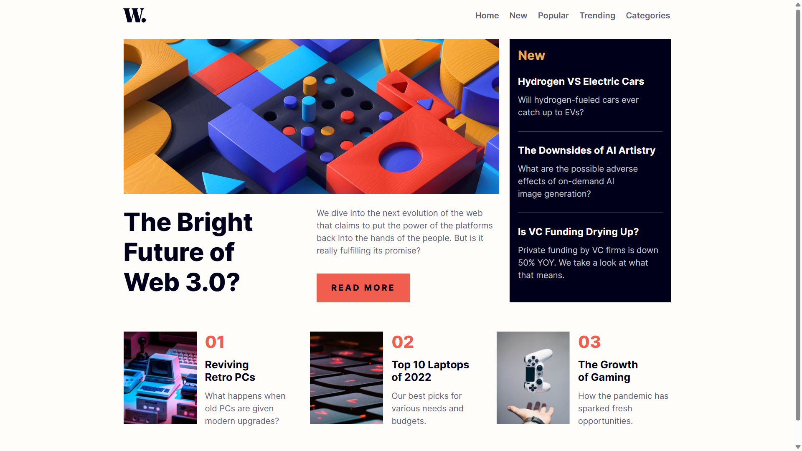
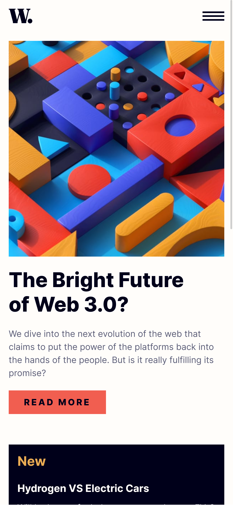
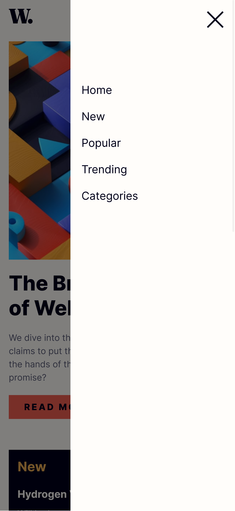

# Frontend Mentor - News homepage solution

This is a solution to the [News homepage challenge on Frontend Mentor](https://www.frontendmentor.io/challenges/news-homepage-H6SWTa1MFl). Frontend Mentor challenges help you improve your coding skills by building realistic projects.

## Table of contents

- [Overview](#overview)
  - [The challenge](#the-challenge)
  - [Screenshot](#screenshot)
  - [Links](#links)
- [My process](#my-process)
  - [Built with](#built-with)
  - [What I learned](#what-i-learned)
- [Author](#author)

**Note: Delete this note and update the table of contents based on what sections you keep.**

## Overview

### The challenge

Users should be able to:

- View the optimal layout for the interface depending on their device's screen size
- See hover and focus states for all interactive elements on the page

### Screenshot

#### Desktop



#### Mobile

<p>
    
    
</p>

### Links

- Live Site URL: [https://julianngabrieldev.github.io/fm-news-homepage/](https://julianngabrieldev.github.io/fm-news-homepage/)

## My process

### Built with

- Semantic HTML5 markup
- CSS custom properties
- JavaScript event listeners
- Flexbox
- CSS Grid
- Mobile-first workflow

### What I learned

- How to use JavaScript events
- Get document elements
- Add and remove classes to elements using JavaScript
- Applying specific styles to elements with JavaScript

```js
const menu = document.getElementById("menu");
const menuBtn = document.getElementById("menu-btn");
const menuCloseBtn = document.getElementById("menu-close-btn");
const windowFilter = document.getElementById("window-filter");

menuBtn.addEventListener("click", () => {
    menu.classList.add("show");
    windowFilter.style.display = "block";
});
menuCloseBtn.addEventListener("click", () => {
    menu.classList.remove("show");
    windowFilter.style.display = "none";
});
window.addEventListener("click", (e) => {
    if (e.target === windowFilter) {
        menu.classList.remove("show");
        windowFilter.style.display = "none";
    }
});
```

## Author

- Julián Alejandro Gabriel Isidro
- Frontend Mentor - [@juliannGabrielDev](https://www.frontendmentor.io/profile/juliannGabrielDev)